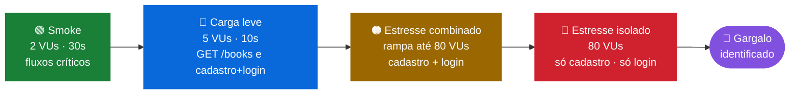
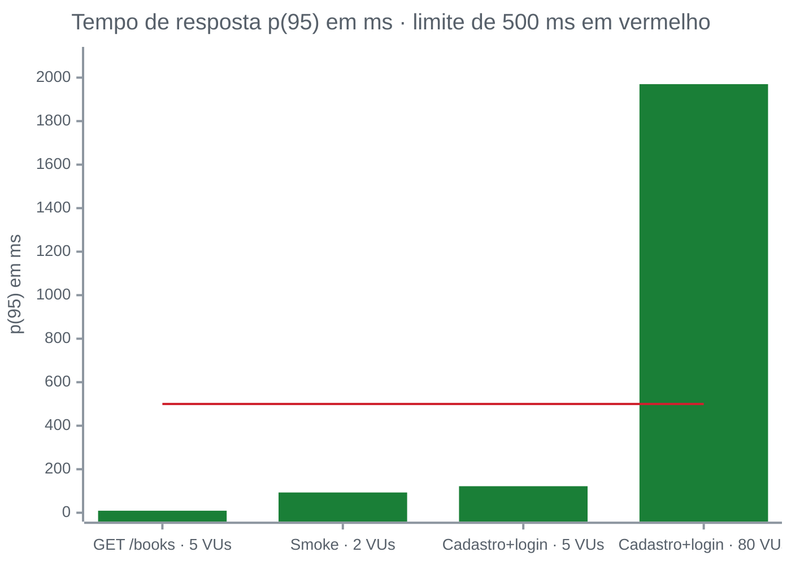
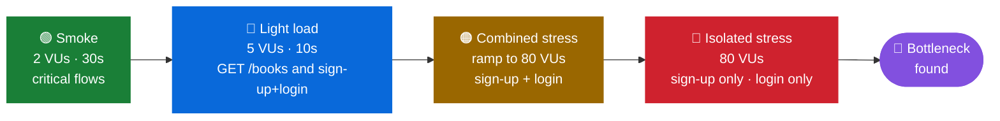
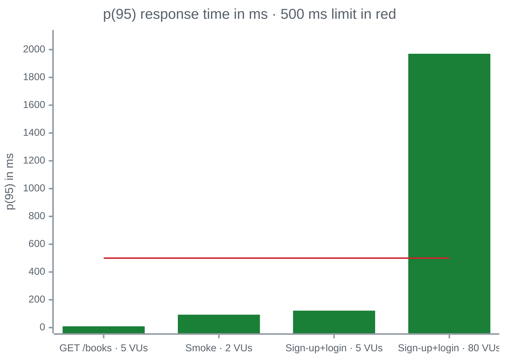

<div align="center">

# ⚡ Hub de Leitura · Testes de Carga e Estresse com k6

**Levei a API de uma biblioteca de 2 a 80 usuários simultâneos, medi a degradação e identifiquei o gargalo de performance**


🇧🇷 [Português](#-português) · 🇺🇸 [English](#-english)

</div>

---

## 🇧🇷 Português

### 🎯 Objetivo

Nos outros projetos eu validei **se** a API do Hub de Leitura funciona. Aqui a pergunta foi outra: **ela continua funcionando bem quando muita gente usa ao mesmo tempo?**

Montei testes de carga e de estresse com k6 para medir três coisas:

- ⏱️ **Tempo de resposta** conforme os usuários simultâneos aumentam
- ❌ **Taxa de erro** sob pressão
- 📉 **Ponto de degradação**, ou seja, a partir de quando a experiência do usuário piora

### 🧭 Estratégia

Construí os cenários em ordem crescente de pressão, isolando cada endpoint para achar a causa da lentidão:



Nos cenários de estresse usei `stages` para subir a carga aos poucos (10 → 40 → 80 VUs), segurar o pico por 30 segundos e depois resfriar. Assim deu para ver o momento exato em que a API começa a sofrer.

Também defini **critérios de aprovação automáticos** (`thresholds`):

| Critério | Estresse | Smoke |
|---|:-:|:-:|
| 95% das respostas abaixo de | 500 ms | 300 ms |
| Requisições com falha | < 1% | < 1% |
| Checks aprovados | — | > 99% |

Se um threshold é violado, o k6 encerra com código de erro. É isso que permite usar o teste como **portão de qualidade num pipeline de CI/CD**.

### 📊 Resultados



| Cenário | Carga | p(95) | Média | Erros | Resultado |
|---|:-:|:-:|:-:|:-:|:-:|
| `GET /books` | 5 VUs · 10s | **9,32 ms** | 6,4 ms | 0% | ✅ |
| Smoke (4 fluxos críticos) | 2 VUs · 30s | **93,1 ms** | — | 0% | ✅ todos os thresholds |
| Cadastro + login | 5 VUs · 10s | **122 ms** | 91,66 ms | 0% | ✅ |
| Cadastro + login (estresse) | rampa até 80 VUs | **1,97 s** | 928,59 ms | 0% | ❌ threshold de p(95) |

No estresse combinado, a API processou **4.954 requisições** em 2.477 iterações ao longo de 90 segundos.

```
█ THRESHOLDS
    http_req_duration
    ✗ 'p(95)<500' p(95)=1.93s
    http_req_failed
    ✓ 'rate<0.01' rate=0.00%
```

### 🔎 O que eu descobri

1. **A API não quebra, mas fica lenta.** Com 80 usuários simultâneos, 100% das requisições voltaram com o status certo e nenhuma falhou. Só que o p(95) saltou de 122 ms para quase 2 segundos, **16 vezes mais lento**.
2. **O gargalo é o hash de senha.** `GET /books` responde em menos de 10 ms. Já cadastro e login usam bcrypt, uma operação propositalmente pesada de CPU, e são justamente os endpoints que degradam. Separei os dois em cenários isolados (`03` e `04`) para confirmar a causa.
3. **Cadastro e login competem entre si.** Rodando juntos, eles disputam o mesmo recurso de CPU, e a degradação é maior do que nos testes isolados.
4. **Status 200 não basta.** Se eu validasse só o status, o teste de 80 VUs teria passado. Foi o threshold de tempo de resposta que mostrou o problema real de experiência do usuário.

### 🧰 Técnicas que apliquei

| Técnica | Onde |
|---|---|
| Usuários virtuais fixos (`vus` + `duration`) | Cenários 00, 01 e 05 |
| Rampa de carga (`stages`) | Cenários 02, 03 e 04 |
| `check()` para validar cada resposta | Todos os cenários com fluxo |
| `thresholds` como critério de aprovação | Cenários 02 a 05 |
| `setup()` para preparar massa antes da carga | Cenário 04, que cria 20 usuários antes do estresse de login |
| E-mails únicos com `__VU`, `__ITER` e `Date.now()` | Cadastro sob concorrência sem colisão |
| Isolamento de endpoint | Cenários 03 e 04 separam cadastro e login |

### 🚀 Onde esse trabalho se aplica

- **Planejamento de capacidade:** os números mostram até onde a API aguenta antes de a experiência piorar, o que ajuda a dimensionar infraestrutura.
- **Direção para o time de desenvolvimento:** apontar o bcrypt como gargalo diz exatamente onde otimizar (fator de custo, fila, escala horizontal).
- **Gate de performance no CI/CD:** com thresholds, o smoke test pode rodar a cada push e barrar um deploy que deixe a API lenta.
- **Complemento dos testes funcionais:** o [projeto de testes de API com Cypress](https://github.com/gustavoanderson/hub-de-leitura-testando-api) valida o comportamento, e este valida a performance da mesma API.

### ▶️ Como executar

**Pré-requisitos:** [k6](https://k6.io/docs/get-started/installation/) instalado (no Windows: `winget install k6 --source winget`) e a API do Hub de Leitura rodando em `http://localhost:3000`.

```bash
k6 run scenarios/05-smoke-test.js            # smoke
k6 run scenarios/02-estresse-cadastro-login.js # estresse combinado
```

| Arquivo | O que faz | Carga |
|---|---|---|
| `00-primeiro-teste.js` | Lista livros (`GET /books`) | 5 VUs · 10s |
| `01-criar-usuario-e-login.js` | Fluxo de cadastro + login | 5 VUs · 10s |
| `02-estresse-cadastro-login.js` | Estresse combinado com thresholds | Rampa até 80 VUs |
| `03-estresse-cadastro.js` | Estresse isolado de `POST /users` | Rampa até 80 VUs |
| `04-estresse-login.js` | Estresse isolado de `POST /login` com `setup()` | Rampa até 80 VUs |
| `05-smoke-test.js` | Fluxos críticos com thresholds rígidos | 2 VUs · 30s |

O passo a passo completo da construção está no [diário do projeto](./DIARIO-DE-APRENDIZADO.md).

---

## 🇺🇸 English

### 🎯 Goal

In other projects I validated **whether** the Hub de Leitura API works. Here the question was different: **does it keep working well when many people use it at the same time?**

I built load and stress tests with k6 to measure response time as concurrent users grow, error rate under pressure and the point where user experience starts to degrade.

### 🧭 Strategy



I used `stages` to ramp load gradually (10 → 40 → 80 VUs) and `thresholds` as automatic pass/fail criteria (p95 < 500 ms under stress, < 300 ms for smoke, < 1% failed requests).

### 📊 Results



| Scenario | Load | p(95) | Errors | Result |
|---|:-:|:-:|:-:|:-:|
| `GET /books` | 5 VUs · 10s | **9.32 ms** | 0% | ✅ |
| Smoke (4 critical flows) | 2 VUs · 30s | **93.1 ms** | 0% | ✅ all thresholds |
| Sign-up + login | 5 VUs · 10s | **122 ms** | 0% | ✅ |
| Sign-up + login (stress) | ramp to 80 VUs | **1.97 s** | 0% | ❌ p(95) threshold |

### 🔎 What I found

1. **The API doesn't break, it slows down.** At 80 concurrent users, 100% of requests returned the right status, but p(95) jumped from 122 ms to almost 2 seconds, **16x slower**.
2. **The bottleneck is password hashing.** `GET /books` answers in under 10 ms, while sign-up and login use bcrypt, a deliberately CPU-heavy operation. I split them into isolated scenarios to confirm the cause.
3. **Sign-up and login compete** for the same CPU, and degradation is worse when they run together.
4. **Status 200 isn't enough.** Checking only status codes, the 80-VU test would have passed. The response-time threshold exposed the real user-experience problem.

### 🚀 Where this applies

- **Capacity planning:** the numbers show how far the API goes before user experience degrades.
- **Clear direction for developers:** pointing to bcrypt tells the team exactly where to optimize.
- **Performance gate in CI/CD:** with thresholds, the smoke test can run on every push and block a slow deploy.
- **Complements functional tests:** my [Cypress API project](https://github.com/gustavoanderson/hub-de-leitura-testando-api) validates behavior, and this one validates performance.

### ▶️ How to run

```bash
k6 run scenarios/05-smoke-test.js
k6 run scenarios/02-estresse-cadastro-login.js
```

---

<div align="center">

Feito por **Gustavo Anderson** · QA Engineer
[](https://www.linkedin.com/in/gustavo-anderson)
[](https://github.com/gustavoanderson)

</div>
